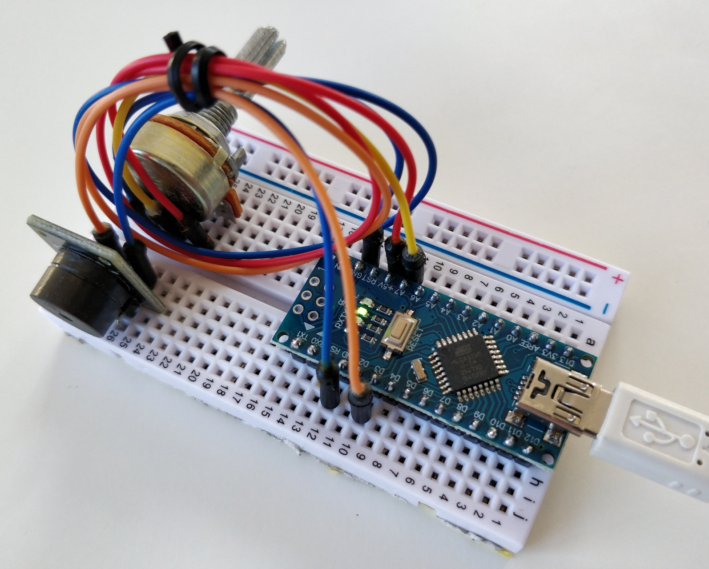

= Bakiwi Chirp Test
Doc Writer <kubisch@informatik.hu-berlin.de>
v0.1, 2019-09-25

_This is the Chirp manual. With the following you can assemble your own bird-like chirping device with only a few components._

=== Components

* breadboard + wire bundle
* Arduino Nano (or compatible board)
* 10k potentiometer
* piezo buzzer

=== Assembly

Connect the potentiometer as a voltage divider (V+,signal,GND) with 'signal' to one of the microcontroller's ADC input pins (e.g. A7).
Connect the piezo to GND and one of the microcontroller's digital output pins (e.g. D3).
Flash the program.

=== Explanation

The basic mechanism for the simple bird-like sound is to exponentially sweep down the frequency from something aroung 6 KHz to something around 4 KHz.
The sweep is further modulated by a slower oscillation and all parameters (including waiting times) are randomized to appear more natural and less technical/predictable.

The potentiometer is for regulating the chirps base-frequency.

